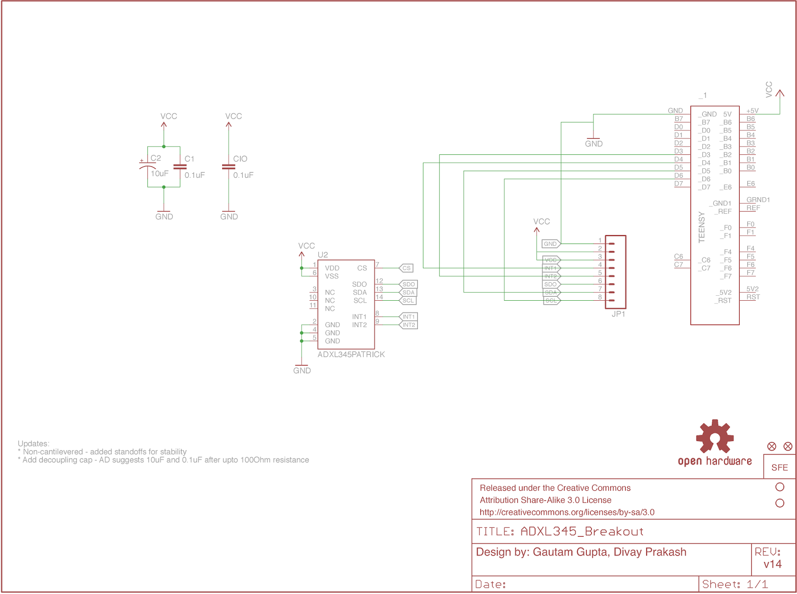

# Handsfree Mouse
Project for IED SYBTech@IIITD

The device we created in this project uses an ADXL345 acceleromenter communicating with an Arduino Leonardo to create a real-time, gesture recognition enabled, motion tracking mouse which can be plugged into any Windows, Macintosh or Linux system and used without any software or driver installation at all. You can check out the blog post documenting our journey [here](http://iedprojects2015.blogspot.in/2015/03/handsfree-mouse-project-scope-weintend.html). We also have a video demonstration which you can see [here](https://www.youtube.com/watch?v=XWZE0celzms).

## Device

## Circuit Diagram

## Pin Diagram

## Team
 - Divay Prakash
 - Gautam Gupta
 - Rishi Mohan
 - Mentor : Dr. Alexander Fell
